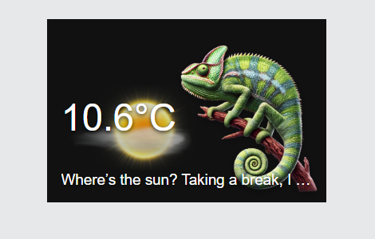

# Chameleon Weather Card

A dependency-free Home Assistant dashboard card adapted from
[MMM-ChameleonWeather](https://github.com/ChrisF1976/MMM-ChameleonWeather/).
It uses a native Home Assistant `weather` entity, so no OpenWeatherMap API key
is exposed to the browser.



## Features

- Changes the chameleon image across five temperature ranges.
- Overlays a day/night-aware icon for every standard Home Assistant weather condition.
- Shows the current temperature from the weather entity or a separate sensor.
- Displays rotating weather quips in English, German, French, or Brazilian Portuguese.
- Supports custom chameleon images, weather icons, ranges, messages, units, and sizing.
- Supports Home Assistant's native conditional Visibility and Sections Layout tabs.
- Includes a graphical editor for common card settings.
- Opens the weather entity's more-info dialog on click or keyboard activation.
- Works in masonry and Sections dashboards without a build step.

## Install manually

1. Copy the complete `chameleon-weather-card` directory, including `images`,
   into Home Assistant's `config/www/` directory.
2. In Home Assistant, open **Settings → Dashboards → Resources**.
3. Add `/local/chameleon-weather-card/chameleon-weather-card.js` as a
   **JavaScript module**.
4. Refresh the dashboard. A hard refresh may be needed after an update.

If the Resources menu is hidden, enable Advanced Mode in your Home Assistant
user profile.

## Minimal card configuration

```yaml
type: custom:chameleon-weather-card
entity: weather.home
```

## Recommended example

```yaml
type: custom:chameleon-weather-card
entity: weather.home
temperature_entity: sensor.outdoor_temperature
name: Backyard weather
language: en
show_temperature: true
show_message: true
use_weather_mapping: true
temperature_decimals: 1
display_unit: auto
image_width: 54%
card_width: 350px
card_height: 230px
grid_options:
  columns: 6
  rows: 4
visibility:
  - condition: state
    entity: input_boolean.show_weather_card
    state: "on"
```

`temperature_entity` is optional. When omitted, the card reads the
`temperature` and `temperature_unit` attributes from the weather entity.

## Configuration

| Option | Required | Default | Description |
| --- | --- | --- | --- |
| `entity` | Yes | — | Home Assistant weather entity, such as `weather.home`. |
| `temperature_entity` | No | Weather attribute | Separate numeric temperature sensor. |
| `name` | No | Hidden | Text title. Set to `true` to use the friendly name. |
| `language` | No | HA language | `en`, `de`, `fr`, or `pt-BR`; other values fall back to English. |
| `show_temperature` | No | `true` | Show or hide temperature. |
| `show_message` | No | `true` | Show or hide the weather quip. |
| `use_weather_mapping` | No | `true` | Show or hide the weather overlay. |
| `temperature_decimals` | No | `1` | Number of decimals, clamped from 0 to 3. |
| `display_unit` | No | `auto` | `auto`, `celsius`, or `fahrenheit`. |
| `range_unit` | No | `celsius` | Unit used by custom range thresholds. |
| `temperature_source_unit` | No | `°C` | Fallback when the selected entity has no unit attribute. |
| `card_width` | No | `100%` | Card CSS width, or a number interpreted as pixels. The card stays within its dashboard column. |
| `width` | No | — | Compatibility alias for `card_width`; `card_width` takes precedence. |
| `image_width` | No | `54%` | Chameleon CSS width, or a number interpreted as pixels. |
| `card_height` | No | `230px` | Minimum card height, or a number interpreted as pixels. Sections rows can stretch it taller. |
| `temperature_ranges` | No | Five bundled ranges | Custom temperature-to-image mappings. |
| `weather_icons` | No | Bundled mapping | Per-condition icon overrides. |
| `weather_image_path` | No | `images/weather/` | Base directory for weather icon filenames. |
| `messages` | No | Bundled messages | Message arrays keyed by HA condition or group. |
| `visibility` | No | Always visible | Native Home Assistant visibility conditions. |
| `grid_options` | No | 6 columns × 4 rows | Native Sections-layout dimensions. |

The default ranges are evaluated in Celsius even if Home Assistant displays
Fahrenheit. A separate sensor is converted using its `unit_of_measurement`.

## Visual editor, visibility, and layout

Edit the card in Home Assistant to configure its common settings with the
graphical form. Home Assistant supplies two additional native tabs:

- **Visibility** controls when the card appears. It supports entity state,
  numeric state, user, location, time, and screen-size conditions.
- **Layout** controls the card's columns and rows in a Sections dashboard,
  including full width and precise sizing.

These tabs are not available for cards nested inside a vertical stack,
horizontal stack, or grid card. In YAML, use the same native top-level options:

```yaml
type: custom:chameleon-weather-card
entity: weather.home
grid_options:
  columns: full
  rows: 4
visibility:
  - condition: numeric_state
    entity: sensor.outdoor_temperature
    below: 32
  - condition: screen
    media_query: "(min-width: 768px)"
```

When multiple visibility conditions are defined, Home Assistant requires all
of them to match. `grid_options` affects Sections dashboards; `card_width`
still controls the card content within its assigned dashboard slot.

## Custom temperature ranges

Omit `min` for no lower bound and `max` for no upper bound. Image paths may be
card-relative, Home Assistant `/local/...` paths, or full HTTPS URLs.

```yaml
type: custom:chameleon-weather-card
entity: weather.home
temperature_ranges:
  - max: 0
    image: images/frog/chameleon_below0.png
  - min: 0
    max: 12
    image: /local/my-weather/cold.png
  - min: 12
    max: 24
    image: /local/my-weather/mild.png
  - min: 24
    image: https://example.com/hot-chameleon.png
```

For compatibility with the MagicMirror module, each entry may instead use
`range: [min, max]`.

## Custom icons and messages

Home Assistant's weather condition strings include `sunny`, `clear-night`,
`cloudy`, `fog`, `hail`, `lightning`, `lightning-rainy`, `partlycloudy`,
`pouring`, `rainy`, `snowy`, `snowy-rainy`, `windy`, `windy-variant`, and
`exceptional`.

```yaml
type: custom:chameleon-weather-card
entity: weather.home
weather_icons:
  sunny: /local/my-weather/sun.png
  rainy: rain-custom.png
messages:
  sunny:
    - Solar panels are having a very good day.
  Rain:
    - The garden approves.
    - Umbrella protocol activated.
```

An icon override containing only a filename is loaded from
`weather_image_path`; a path or URL is used directly. Message condition keys
take precedence over group keys: `Clear`, `Clouds`, `Rain`, `Snow`, and
`Extreme`.

## Updating

Replace the JavaScript file and the `images` directory, then hard-refresh the
dashboard. If Home Assistant keeps an older resource, temporarily append a
version query such as `?v=1.2.0` to its resource URL.

## Attribution and license

This adaptation preserves the upstream MIT license. Chameleon artwork,
weather overlays, and the default message text originate from
[ChrisF1976/MMM-ChameleonWeather](https://github.com/ChrisF1976/MMM-ChameleonWeather/).
See `LICENSE` and `NOTICE`.
