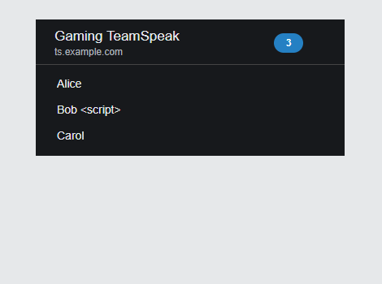

# TeamSpeak 3 Card for Home Assistant

A Home Assistant integration and Lovelace card adapted from
[MMM-teamspeak3](https://github.com/Thlb/MMM-teamspeak3). It securely polls a
TeamSpeak 3 ServerQuery endpoint from Home Assistant, filters out ServerQuery
connections, and displays the connected voice-client nicknames.



## Why the package has two parts

TeamSpeak's traditional ServerQuery interface is a raw TCP protocol and needs
a username and password. A browser card cannot safely connect to it or protect
those credentials. This package therefore contains:

- `custom_components/teamspeak3_monitor`: the Home Assistant backend that
  stores credentials and polls TeamSpeak.
- `www/teamspeak3-card`: the dashboard card, which receives only the safe
  sensor state and client-name list.

The password is never included in the entity attributes or sent to the
dashboard browser.

## Features

- UI-based TeamSpeak ServerQuery setup—no YAML credentials.
- Selects a virtual server by voice port or server ID.
- Polls at a configurable interval and reconnects on each update.
- Filters ServerQuery clients exactly like MMM-teamspeak3.
- Provides credential reauthentication and full connection reconfiguration.
- Shows nicknames, online count, empty-server and unavailable states.
- Configurable icons, alignment, sizes, messages, limits, sorting, and card size.
- Optional manual refresh button.
- Graphical card editor plus Home Assistant's native Visibility and Layout tabs.
- Escapes ServerQuery values and renders nicknames with `textContent` to prevent
  command or HTML injection.

## Requirements

- Home Assistant 2026.6 or newer is recommended.
- A reachable TeamSpeak 3 raw ServerQuery endpoint, normally TCP port `10011`.
- A ServerQuery login allowed to select the virtual server and run `clientlist`.

Use a dedicated, least-privilege ServerQuery account rather than the global
`serveradmin` account. The Home Assistant host may also need to be added to the
TeamSpeak query allowlist.

## Installation

1. From this package, copy `custom_components/teamspeak3_monitor` to:

   ```text
   <Home Assistant config>/custom_components/teamspeak3_monitor
   ```

2. Copy `www/teamspeak3-card` to:

   ```text
   <Home Assistant config>/www/teamspeak3-card
   ```

3. Restart Home Assistant.
4. Open **Settings → Devices & services → Add integration** and search for
   **TeamSpeak 3 Monitor**.
5. Enter the server host, ServerQuery port, username, password, and voice port.
   If you provide a server ID, it takes precedence over the voice port.
6. Confirm that the integration creates an **Online clients** sensor.
7. Open **Settings → Dashboards → Resources** and add this URL as a
   **JavaScript module**:

   ```text
   /local/teamspeak3-card/teamspeak3-card.js?v=1.0.0
   ```

8. Add the card to a dashboard using the sensor entity ID created in step 6.

If the Resources menu is hidden, enable Advanced Mode in your Home Assistant
user profile.

## Minimal card

```yaml
type: custom:teamspeak3-card
entity: sensor.teamspeak_3_online_clients
```

## Full example

```yaml
type: custom:teamspeak3-card
entity: sensor.teamspeak_3_online_clients
name: Gaming TeamSpeak
show_header: true
show_count: true
show_icon: true
show_refresh: true
show_server: true
sort_clients: false
text_align: left
text_size: small
icon_size: small
icon: mdi:account-voice
empty_message: Nobody's online!
unavailable_message: TeamSpeak server unavailable
max_clients: 0
card_width: 100%
card_height: 160px
grid_options:
  columns: 6
  rows: 3
visibility:
  - condition: state
    entity: input_boolean.show_teamspeak
    state: "on"
```

## Card configuration

| Option | Required | Default | Description |
| --- | --- | --- | --- |
| `entity` | Yes | — | Sensor created by TeamSpeak 3 Monitor, or another entity exposing a client list. |
| `name` | No | Entity name | Header title. |
| `client_attribute` | No | `clients` | Attribute containing an array, JSON array, or comma-separated names. |
| `show_header` | No | `true` | Show the title row. |
| `show_count` | No | `true` | Show the online-client count badge. |
| `show_icon` | No | `true` | Show an icon beside each nickname. |
| `show_refresh` | No | `false` | Show a button that requests an immediate entity update. |
| `show_server` | No | `false` | Show the server host below the title. |
| `sort_clients` | No | `false` | Sort nicknames using the Home Assistant language. |
| `text_align` | No | `left` | `left` or `right`. Right alignment moves icons to the right. |
| `text_size` | No | `small` | `xsmall`, `small`, `medium`, `large`, or `xlarge`. |
| `icon_size` | No | `small` | `xsmall`, `small`, `medium`, `large`, or `xlarge`. |
| `icon` | No | `mdi:account-voice` | Any icon available in Home Assistant. |
| `empty_message` | No | `Nobody's online!` | Text shown when no voice clients are connected. |
| `unavailable_message` | No | `TeamSpeak server unavailable` | Text shown when the sensor is unavailable. |
| `max_clients` | No | `0` | Maximum displayed names; `0` displays all. |
| `card_width` | No | `100%` | CSS width or a number interpreted as pixels. |
| `width` | No | — | Compatibility alias for `card_width`. |
| `card_height` | No | `160px` | Minimum height; the list scrolls if a fixed Sections layout is smaller than its content. |
| `visibility` | No | Always visible | Native Home Assistant visibility conditions. |
| `grid_options` | No | 6 columns × 3 rows | Native Sections-layout dimensions. |

## Integration options

Open the integration's menu under **Settings → Devices & services**:

- **Configure** changes the polling interval from 5 to 3600 seconds.
- **Reconfigure** changes host, ports, credentials, or server ID and validates
  the new settings before saving.
- Authentication failures automatically start a credential repair flow.

The sensor state is the number of online voice clients. Its attributes include:

```yaml
clients:
  - Alice
  - Bob
client_details:
  - nickname: Alice
    client_id: 3
    channel_id: 7
server: ts.example.com
voice_port: 9987
query_port: 10011
server_id: null
```

No username or password is exposed.

## Visibility and layout

When editing a top-level card, use Home Assistant's native **Visibility** tab
for state, numeric state, time, user, location, or screen-size conditions. Use
the **Layout** tab in a Sections dashboard to set columns and rows.

The tabs are not available to cards nested inside vertical stack, horizontal
stack, or grid cards. The equivalent YAML keys are `visibility` and
`grid_options`, as shown in the full example.

## Troubleshooting

- **Cannot connect:** Verify the host and TCP query port, normally `10011`.
  Check firewalls, NAT, provider restrictions, and the TeamSpeak query allowlist.
- **Invalid authentication:** Create or reset a ServerQuery login and use the
  repair flow shown by Home Assistant.
- **Invalid server:** Confirm the voice port or server ID and ensure the query
  account can select that virtual server and run `clientlist`.
- **Card says entity not found:** Replace the sample entity ID with the actual
  Online clients sensor from **Developer tools → States**.
- **Old card remains after update:** Hard-refresh the browser or change the
  resource query string, for example from `?v=1.0.0` to a newer version.

## Attribution and license

The behavior and configuration model are adapted from
[Thlb/MMM-teamspeak3](https://github.com/Thlb/MMM-teamspeak3), distributed
under the MIT license. See `LICENSE` and `NOTICE`.
